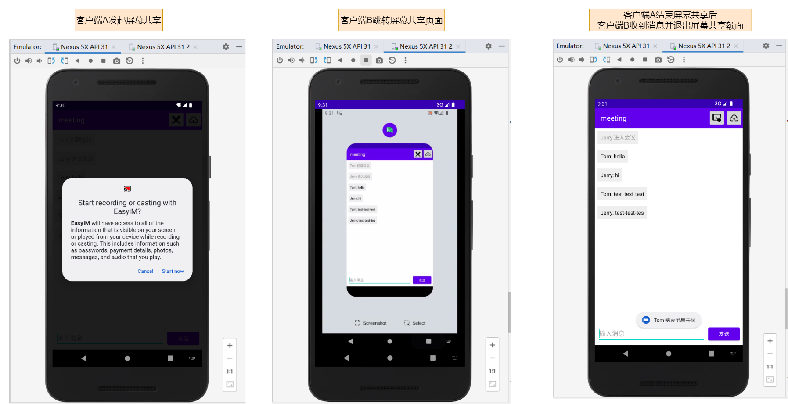

# Title

EasyIM 客户端

一款基于Netty搭建的即时通讯软件，内部实现了私有协议栈、Protostuff序列化方式、解决TCP粘包半包问题、长连接握手认证、心跳检测机制、客户端断线重连机制以及消息超时重发机制。软件具备多人文字聊天、多媒体文件共享、屏幕共享及语音共享功能。

EasyIM 服务器地址：[https://github.com/bonalucas/easy-im](https://github.com/bonalucas/easy-im)

## Environment

```
- JDK 8
- SDK 31
- gradle 7.1.1
```

## Usage

### clone

```
git clone https://github.com/bonalucas/easy-im-android.git
```

### signaling-server

信令服务器搭建（对应代码放在了signaling-server包下）

由于使用的是Nodejs搭建，可以在signaling-server下使用`npm install`安装相关依赖后，使用`node server.js`启动即可

### configuration

com/easyim/client/common/ClientConfig.java（根据自己部署的Netty服务器地址进行对应更改Netty服务器IP地址与Port端口号配置）

```java
/**
 * 客户端配置类
 *
 * @author 单程车票
 */
public class ClientConfig {

    /**
     * Netty服务器IP地址
     */
    public static final String SERVER_IP = "100.2.135.237";

    /**
     * Netty服务器端口号
     */
    public static final int SERVER_PORT = 9043;
}
```

com/easyim/rtc/SignalingClient.java（根据自己部署的信令服务器地址进行对应更改信令服务器地址）

```java
/**
 * 信令客户端
 *
 * @author 单程车票
 */
public class SignalingClient {

    /**
     * WebSocket服务器地址
     */
    private static final String socketUrl = "http://100.2.135.237:9075";
}
```

### Tree

```
└─com
    └─easyim
        ├─activity      // 放置页面相关活动类
        ├─adapter       // 会议页面适配器
        ├─client        // Netty客户端核心代码
        │  ├─common
        │  └─handler
        │      └─biz
        ├─comm
        │  ├─message    // 自定义通信消息体
        │  │  ├─chat
        │  │  ├─error
        │  │  ├─file
        │  │  ├─handshake
        │  │  ├─heartbeat
        │  │  ├─meeting
        │  │  └─screen
        │  └─protocol   // 编解码器及序列化器
        ├─common        // 基础包
        ├─event         // 事件分发中心
        ├─rtc           // WebRTC客户端核心代码
        └─service       // 处理接收到Netty服务器消息
            └─handler
                └─impl
```

## Example





## License

Apache-2.0 license
